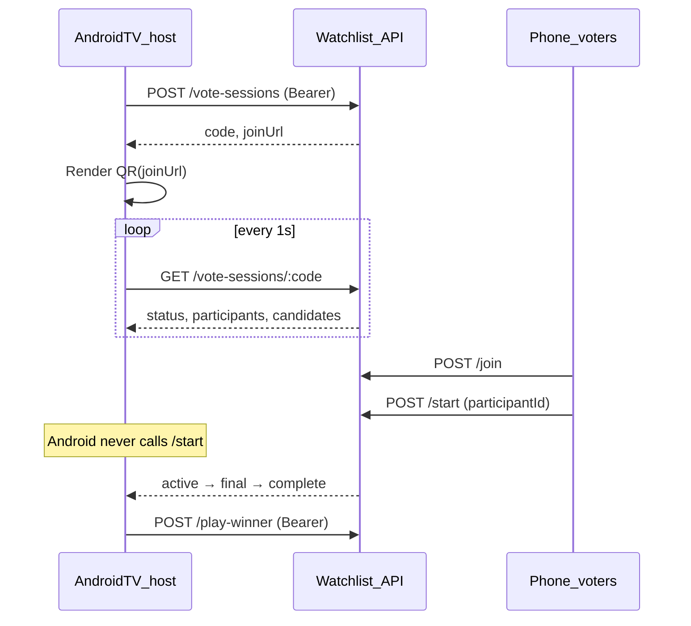

# Android TV voting host

Integration guide for the **Android TV host app** (separate repo). The TV app creates a voting session, shows a QR code for phones to join, polls server state, and plays the winner. It does **not** join as a voter or start voting — phones handle that.

For API field reference shared with phone clients, see [VOTING_SESSIONS.md](./VOTING_SESSIONS.md). For voting rules (unanimous want, plurality final), see [BUSINESS_LOGIC.md](./BUSINESS_LOGIC.md).

## Roles

| Client | Responsibility |
|--------|----------------|
| **Android TV (this app)** | Create session, show QR, poll state, display lobby/rounds/winner, play winner |
| **Phone browsers** (`/vote/:code`) | Join with display name, start voting, cast votes |
| **Web host** (`/vote-host/:code`) | Same display role as Android; read-only during lobby |



## Prerequisites

- **Base URL** — HTTPS origin of the watchlist server (same host embedded in `joinUrl`, configured as `OAUTH_HOST` on the server).
- **Trakt access token** — obtained via your existing Trakt OAuth flow in the Android app.
- **Selected Trakt list** — `trakt_list_id` and list owner slug from `GET /api/lists`.

### Authentication header

Host-only requests use:

```http
Authorization: Bearer <trakt_access_token>
Content-Type: application/json
```

Endpoints that require auth: `POST /api/vote-sessions`, `POST /api/vote-sessions/:code/play-winner`, `POST /api/vote-sessions/:code/cancel`, `GET /api/lists`.

Polling (`GET /api/vote-sessions/:code`) and poster URLs require **no** auth.

Optional: `POST /api/auth/device` with body `{ "token": "<trakt_access_token>" }` establishes a cookie session if other APIs need it. Bearer alone is sufficient for the voting host flow.

## Start Voting button — full flow

### 1. Load lists (if not already cached)

`GET /api/lists`

**Auth:** Bearer

Returns Trakt list objects. For session create, use:

- `trakt_list_id` ← `list.ids.trakt` (number or string)
- `trakt_list_user_slug` ← `list.user.username`

### 2. Create session

`POST /api/vote-sessions`

**Auth:** Bearer

**Body:**

```json
{
  "trakt_list_id": "12345",
  "trakt_list_user_slug": "username",
  "service_type": "adb-googletv"
}
```

| Field | Notes |
|-------|-------|
| `trakt_list_id` | Trakt list id from selected list |
| `trakt_list_user_slug` | Trakt username that owns the list |
| `service_type` | Use `adb-googletv` for Google TV launch via server ADB. Other values: `browser`, `device-googletv` |

**Response (201/200):**

```json
{
  "id": "uuid-of-session-row",
  "code": "MUMT3B",
  "joinUrl": "https://your-host/vote/MUMT3B"
}
```

- `code` — 6-character session code (also in URL).
- `joinUrl` — absolute URL phones should open. Format: `{OAUTH_HOST}/vote/{code}`.

**Errors:**

| Status | Meaning |
|--------|---------|
| 400 | Missing list fields, or no non-hidden watchables on the list |
| 401 | Invalid or expired Trakt token |

Store `code` for polling and `joinUrl` for the QR code.

### 3. Show QR code on TV

The server does **not** return a QR image. Encode `joinUrl` locally (e.g. ZXing, Compose QR).

Suggested lobby UI (until `status` leaves `lobby`):

- Large QR encoding `joinUrl`
- Session code as text (for manual entry)
- `joinUrl` as smaller text
- **Players joined: N** — from poll `participants.length`
- Player names — `participants[].displayName`
- Message: **Waiting for everyone to join** (phones start voting; TV does not)

### 4. Poll session state

`GET /api/vote-sessions/{code}`

**Auth:** none

Poll approximately **every 1 second** from session create until `status` is `complete` or `cancelled`.

**Response shape:**

```json
{
  "id": "uuid",
  "code": "MUMT3B",
  "joinUrl": "https://your-host/vote/MUMT3B",
  "status": "active",
  "phase": "round1",
  "serviceType": "adb-googletv",
  "participants": [
    { "id": "participant-uuid", "displayName": "Alice" }
  ],
  "currentCandidate": {
    "id": 42,
    "title": "Movie Title",
    "imageUrl": "/api/vote-sessions/MUMT3B/img/42",
    "overview": "Synopsis text or null",
    "rogerebertUrl": "https://www.rogerebert.com/reviews/...",
    "webUrl": "https://..."
  },
  "finalists": [],
  "voteProgress": { "submitted": 2, "required": 4 },
  "winner": null
}
```

| Field | When present |
|-------|----------------|
| `currentCandidate` | `status === "active"` and `phase === "round1"` |
| `finalists` | `status === "final"` and `phase === "round2"` (1–3 items) |
| `winner` | `status === "complete"` |
| `voteProgress` | During `round1` and `round2`; `required` equals participant count |

**Poster images:** `imageUrl` is a path relative to the server base URL. Load with:

```text
{baseUrl}{imageUrl}
```

Example: `https://your-host/api/vote-sessions/MUMT3B/img/42` — no auth required; only works for watchables in that session.

## UI state machine

Use `status` and `phase` to choose the TV screen:

| `status` | `phase` | TV screen |
|----------|---------|-----------|
| `lobby` | `null` | QR + join URL + participant count/names. Do **not** show a Start button on TV. |
| `active` | `round1` | Current candidate card (`currentCandidate`), synopsis, poster, vote progress |
| `final` | `round2` | Finalists grid (`finalists[]`), vote progress |
| `complete` | `round2` | Winner card (`winner`), **Play** button |
| `cancelled` | any | Session expired (4h idle) or cancelled — show error and exit |

**Vote progress:** display `voteProgress.submitted` / `voteProgress.required` during rounds.

**Who starts voting?** A phone voter calls `POST /api/vote-sessions/:code/start` after joining. The TV host only observes the transition from `lobby` → `active` via polling.

## Play the winner

When poll returns `status === "complete"` and `winner` is non-null:

`POST /api/vote-sessions/{code}/play-winner`

**Auth:** Bearer (same host user that created the session)

**Body:** empty or `{}`

**Success example:**

```json
{
  "uri": "https://...",
  "message": "Playing Movie Title with adb-googletv",
  "result": true
}
```

For `adb-googletv`, the server sends the launch intent to Google TV via ADB; the Android app does not need to open `uri` locally.

**Errors:**

| Status | Meaning |
|--------|---------|
| 400 | Voting not finished, or winner has no `web_url` configured |
| 404 | Session not found |

**Alternative:** `POST /api/play/adb-googletv/{watchable_id}` with `winner.id` and Bearer auth.

Show a **Play** button on the winner screen (user-triggered). Do not auto-play on TV unless you explicitly want that UX.

## Endpoints the Android host must NOT call

These are for **phone voters** only:

| Endpoint | Purpose |
|----------|---------|
| `POST /api/vote-sessions/:code/join` | Phone joins lobby |
| `POST /api/vote-sessions/:code/start` | Phone starts voting |
| `POST /api/vote-sessions/:code/vote` | Phone casts vote |

Implementing start on the TV host will not work as designed — phones are expected to start when everyone has joined.

## Optional: cancel session

`POST /api/vote-sessions/{code}/cancel`

**Auth:** Bearer (must be the user who created the session)

Stops the session. Poll will eventually show `status: "cancelled"`.

## Error handling summary

| Situation | Action |
|-----------|--------|
| 401 on host endpoints | Refresh Trakt token, retry |
| 404 on poll | Invalid `code` or session deleted |
| 400 on create | List has no votable items; pick another list |
| `status: "cancelled"` on poll | Session timed out (4h) or host cancelled — exit flow |
| Play 400 | Winner missing streaming URL in watchlist data |

## Example pseudo-code (Kotlin-style)

```kotlin
data class HostConfig(
    val baseUrl: String,
    val accessToken: String,
    val traktListId: String,
    val traktListUserSlug: String,
)

suspend fun runVotingSession(config: HostConfig) {
    val create = api.postVoteSession(
        bearer = config.accessToken,
        body = CreateSessionBody(
            trakt_list_id = config.traktListId,
            trakt_list_user_slug = config.traktListUserSlug,
            service_type = "adb-googletv",
        ),
    )
    val code = create.code
    ui.showQr(create.joinUrl, create.code)

    while (true) {
        val session = api.getVoteSession(code)
        when (session.status) {
            "lobby" -> ui.showLobby(
                joinUrl = session.joinUrl,
                participants = session.participants,
            )
            "active" -> ui.showRound1(
                candidate = session.currentCandidate!!,
                progress = session.voteProgress,
            )
            "final" -> ui.showFinal(
                finalists = session.finalists,
                progress = session.voteProgress,
            )
            "complete" -> {
                ui.showWinner(session.winner!!) { onPlay ->
                    if (onPlay) {
                        api.playWinner(config.accessToken, code)
                    }
                }
                return
            }
            "cancelled" -> {
                ui.showError("Session ended")
                return
            }
        }
        delay(1000)
    }
}

fun posterUrl(baseUrl: String, imageUrl: String): String =
    if (imageUrl.startsWith("http")) imageUrl else baseUrl.trimEnd('/') + imageUrl
```

## Checklist for implementers

1. [ ] Trakt OAuth → store `access_token`
2. [ ] `GET /api/lists` → user picks list
3. [ ] **Start Voting** → `POST /api/vote-sessions` with Bearer
4. [ ] Render QR from `joinUrl` (not from `code` alone, unless you rebuild `{base}/vote/{code}`)
5. [ ] Poll `GET /api/vote-sessions/:code` every ~1s
6. [ ] Lobby: show participant count; wait for phones to start
7. [ ] Round 1 / final: show candidates and vote progress
8. [ ] Complete: show winner + Play → `POST /play-winner`
9. [ ] Do not call `/join`, `/start`, or `/vote` from the TV app
